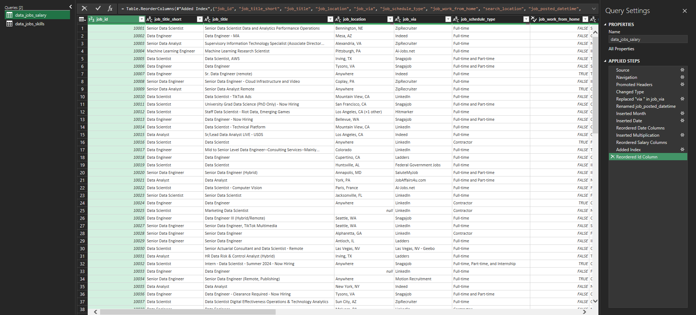
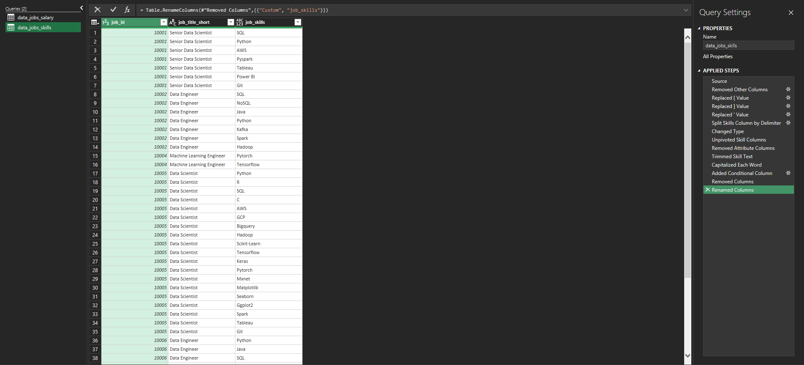
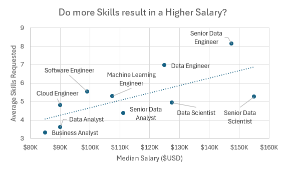
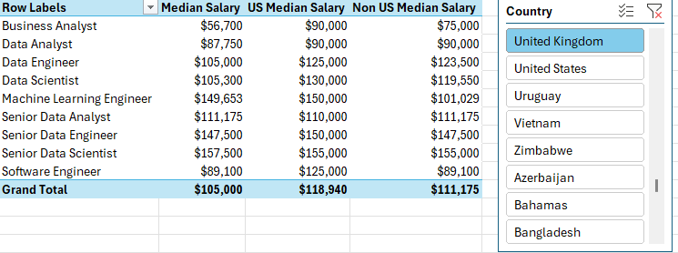
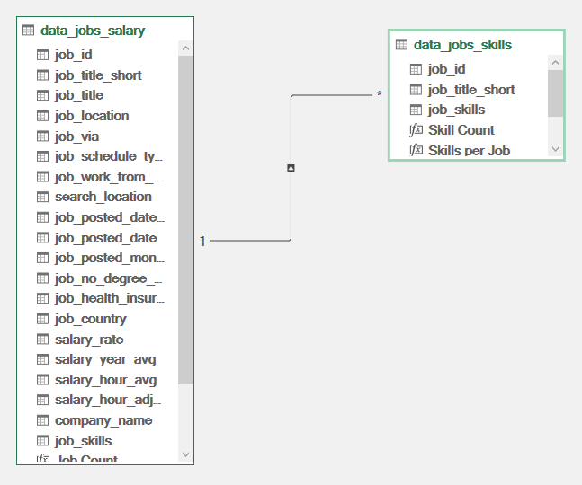
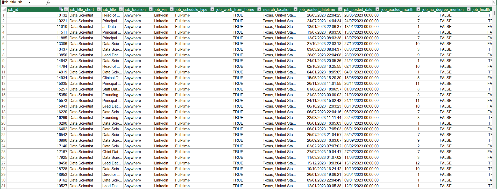
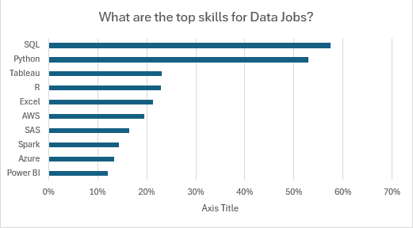
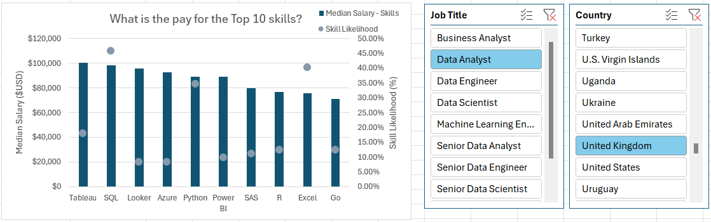

# Data Job Market Analysis: Skills, Salaries & Regional Trends

## Overview

This project is a deep-dive analysis of the 2023 data job market, built entirely in Excel to demonstrate advanced data analytics capabilities: **Power Query (ETL), Power Pivot (data modeling), DAX (calculated measures), PivotTables, and advanced PivotCharts.**

As a job seeker myself, I wanted real answers to the questions that actually matter when deciding what to learn and where to look for work: which skills are worth my time, what pay I should expect, and how location changes the picture. Rather than relying on generic advice, I built a full analytical workflow - from raw data to decision-ready visuals - to answer these questions with data.

This repo documents that workflow model by model: what I built, how I built it, what it showed, and what someone could actually do with it.

### The Dataset

I worked with a real-world dataset of 2023 data science job postings, containing job titles, salaries, locations, and the skills listed on each posting. *(Dataset sourced via Luke Barousse's Excel for Data Analytics course.)*

### Questions I Set Out to Answer

1. **Do more skills get you better pay?**
2. **What's the salary for data jobs in different regions?**
3. **What are the top skills of data professionals?**
4. **What's the pay for the top 10 skills?**

### Skills Demonstrated in This Project

- :mag: **Power Query** - Extracting, cleaning, and transforming raw data (ETL)
- :muscle: **Power Pivot** - Building a relational data model across multiple tables
- :abacus: **DAX** - Writing calculated measures for dynamic aggregation
- :bar_chart: **PivotTables** - Summarising and slicing large datasets
- :chart_with_upwards_trend: **PivotCharts** - Building combo/dual-axis visuals for comparative analysis

---

## Model 1: Do More Skills Get You Better Pay?

### Skill Displayed: **Power Query (ETL)**

### Creation Process
I used Power Query to build a proper ETL pipeline rather than working with the raw file directly:

- **Extract:** Pulled in the source workbook (`data_salary_all.xlsx`) and split it into two separate queries - one holding the full job postings data, and one listing every skill tied to each job ID.
- **Transform:** Cleaned both queries by correcting column data types, dropping unnecessary columns, stripping unwanted text, and trimming whitespace so the data would join and aggregate correctly downstream.
- **Load:** Loaded both cleaned queries into the workbook as the foundation for every model that follows.

`data_jobs_all` query after transformation and load:



`data_jobs_skills` query after transformation and load:




### Insights/Results
- There's a clear positive correlation between the number of skills listed on a job posting and its median salary - most visible in roles like Senior Data Engineer and Data Scientist.
- Roles requiring fewer skills, like Business Analyst, consistently land at the lower end of the pay scale.

<div align="center"></div>

### Conclusion
For job seekers, stacking complementary skills is better for increasing earning potential, more so than going deep on a single tool. For employers, this is a useful benchmark; if a role's skill requirements have crept up over time, compensation should be tracking with it, or the posting risks under-pricing the position relative to market.

---

## Model 2: What's the Salary for Data Jobs in Different Regions?

### Skill Displayed: **PivotTables & DAX**

### Creation Process
- Built a PivotTable directly off the Power Pivot data model, with `job_title_short` in the rows and `salary_year_avg` in the values.
- Wrote a DAX measure to isolate the median salary specifically for United States postings:

```dax
US Median Salary :=CALCULATE(MEDIAN(data_jobs_all[salary_year_avg]),data_jobs_all[job_country] = "United States")
```

- Wrote a second, simpler measure for the overall median salary across all regions:

```dax
Median Salary := MEDIAN(data_jobs_all[salary_year_avg])
```

### Insights/Results
- Senior Data Engineer and Data Scientist roles command the highest median salaries both inside and outside the US.
- The US/non-US salary gap is most pronounced in high-tech roles, possibly reflecting how concentrated the tech industry still is in the US market.



### Conclusion
This model is directly useful for salary negotiation and career planning. **Job seekers evaluating remote or international roles should benchmark offers against these regional gaps rather than a single global average**, and employers setting pay bands across regions can use this kind of model to stay competitive without over or under-paying, relative to local market conditions.

---

## Model 3: What Are the Top Skills of Data Professionals?

### Skill Displayed : **Power Pivot (Data Modeling)**

### Creation Process
- Combined the `data_jobs_all` and `data_job_skills` tables into a single Power Pivot data model rather than working with them as separate, disconnected tables.
- Because both tables had already been cleaned in Power Query, Power Pivot was able to establish a clean relationship between them on the shared `job_id` column.

Relationship built between the two tables:

<div align="center"></div>

Using the Power Pivot menu to manage the model and build out measures:




### Insights/Results
- SQL and Python are the clear leaders in demand across data roles, confirming their status as foundational tools in the field.
- Cloud platforms - AWS and Azure specifically - show a strong and growing presence, reflecting the industry's shift toward cloud-based data infrastructure.

<div align="center"></div>

### Conclusion
For job seekers, this is an insight map. **SQL and Python aren't optional, and cloud familiarity is quickly becoming the norm rather than a differentiator.** For training providers, bootcamps, etc, this data model offers a straightforward way to keep curriculum or upskilling programs aligned with what the market is actually asking for.

---

## Model 4: What's the Pay for the Top 10 Skills?

### Skill Displayed : **Advanced Charts (Combo PivotChart)**

### Creation Process
- Built a combo PivotChart to plot two different metrics on the same visual, pulled straight from the PivotTable behind it:
  - **Primary axis:** Median salary, shown as a clustered column
  - **Secondary axis:** Skill likelihood (%), shown as a line with markers
- Customised the chart for readability - added axis titles, removed the connecting line so only the markers showed, and switched the markers to diamonds to make them easier to distinguish against the columns.

### Insights/Results
- Python, Oracle, and SQL show the strongest combination of high median salary and high demand.
- PowerPoint and Word sit at the bottom on both salary and likelihood, suggesting they're baseline expectations rather than differentiators.

<div align="center"></div>

### Conclusion
This chart makes it easy to see where you should spend your time. **For anyone deciding what to learn next, Python and SQL are the highest-leverage investments** - they show up both as high-demand and high-paying, which isn't true of every skill on the list.

---
